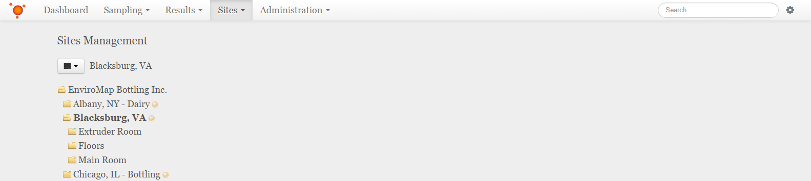
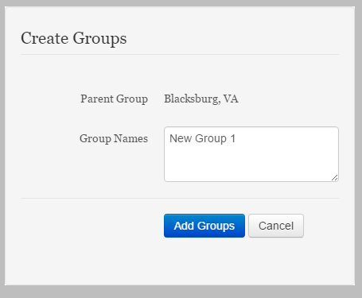

Add Groups
===============================
Detailing the addition of Groups to the Sites and Groups tree.

**In this Article**
    - `Navigating to and through the Sites and Groups`_
    - `Selecting the Parent Group for the new Groups to be added`_
    - `Using the Create Groups dialog`_

Navigating to and through the Sites and Groups
-----------------------------------------------

Select the **Sites** dropdown from the navigation bar at the top, then select the **Sites and Groups** item from the list.
Navigate through the Sites and Groups Tree by selecting any Group with a folder icon to view all Sites and Groups contained within that Group.

Selecting the Parent Group for the new Groups to be added
----------------------------------------------------------

To add a group, you will select the group you wish to add the new group to, then select the menu icon at the top of the Sites and Groups tree.

    
.. note::

	You may also access the group menu by right-clicking on the parent group.
    
Select the **Add Groups** item from the menu dropdown which will open the *Create Groups* dialog.

Using the Create Groups dialog
----------------------------------

Enter the name(s) of the Group(s) you wish to add to the parent group, and then click or tap **Save Changes** to finalize these groups. You may also click or tap **Cancel** to stop adding new groups.

    
The new groups should appear in the parent group that was selected earlier. 