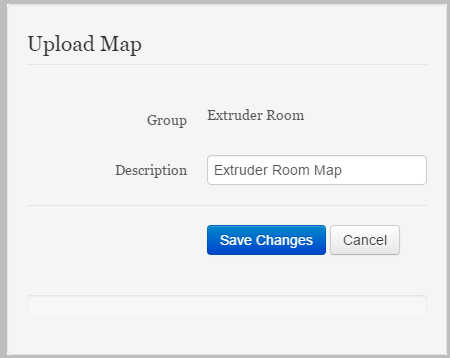

Add a Map
===============================
Detailing the addition of a Map to the Sites and Groups tree.

**In this Article**
    - `Navigating to and through the Sites and Groups Page`_
    - `Placing the new Map in the correct group`_
    - `Using the Upload Map dialog`_

Navigating to and through the Sites and Groups Page
-----------------------------------------------

Select the **Sites** dropdown from the navigation bar at the top, then select the **Sites and Groups** item from the list.
Navigate through the Sites and Groups Tree by selecting any Group with a folder icon to view all Sites and Groups contained within that Group.
Ensure the Group to which you wish to upload a map is showing on the screen.

Placing the new Map in the correct group
----------------------------------------------------------

To add a Map, select the image file on your local machine, and then drag the file to the group you wish that image to be a map for.

.. note::

	If the Group already has a map associated with it, this new map will replace the old one.
    
Releasing the file while it is over the group will open the *Upload Map* dialog.

Using the Upload Map dialog
----------------------------------

Enter the name the map should be known by.

    
After all relevant Information has been added, click or tap **Save Changes** to upload this map. You may also click or tap **Cancel** to stop uploading this map.
    
The new map should appear in the right side of the screen, and the parent group associated with this map should now have a globe icon to the right of its name in the Sites and Groups tree. 