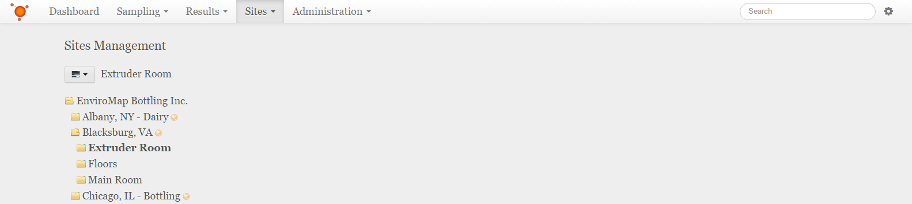
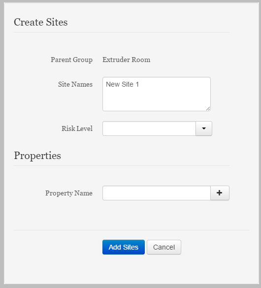

Add Sites
===============================
Detailing the addition of Sites to the Sites and Groups tree.

**In this Article**
    - `Navigating to and through the Sites and Groups`_
    - `Selecting the Parent Group to which the new Sites will be added`_
    - `Using the Create Sites dialog`_

Navigating to and through the Sites and Groups
-----------------------------------------------

Select the **Sites** dropdown from the navigation bar at the top, then select the **Sites and Groups** item from the list.
Navigate through the Sites and Groups Tree by selecting any Group with a folder icon to view all Sites and Groups contained within that Group.

Selecting the Parent Group to which the new Sites will be added
----------------------------------------------------------

To add a site, you will select the group you wish to add the new site to, then select the menu icon at the top of the Sites and Sites tree.

    
.. note::

	You may also access the group menu by right-clicking on the parent group.
    
Select the **Add Site(s)** item from the menu dropdown which will open the *Create Sites* dialog.

Using the Create Sites dialog
----------------------------------

Enter the name(s) of the Site(s) you wish to add to the parent group, as well as the risk level, and any additional properties for these sites.

.. note::

	If you wish to add multiple Sites, separate individual names for Sites by placing them on a new line with the return or enter key.

    
After all relevant Information has been added, click or tap **Save Changes** to finalize these sites. You may also click or tap **Cancel** to stop adding new sites.
    
The new sites should appear in the parent group that was selected earlier. 