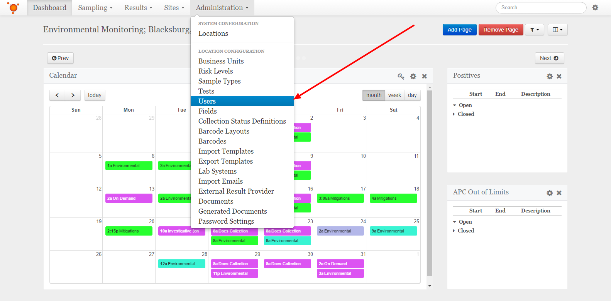
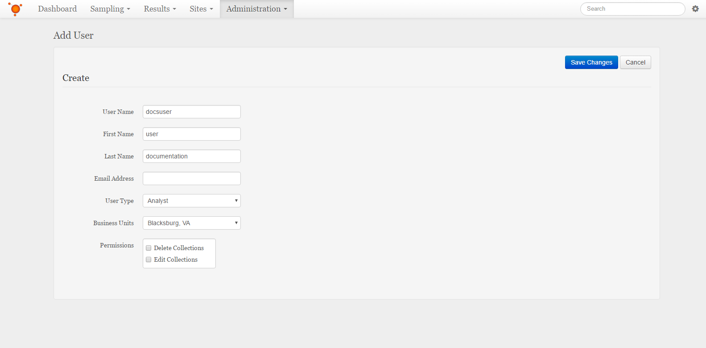

Add Users
===============================
Select the **Administration** dropdown from the navigation bar at the top, then select the **Users** item from the list.
Alternatively, if you are already in one of the Administration pages, you can navigate to the Users from the list on the left.

    
Click or tap the **+ Create** button to the top-right of the Users list.

Fill in the name of the new User, their first and last name, and their email to be used for any notifications. Then select their permission level, and which business units they may access.
You will not be able to select any business units that you do not have access to, or a permission level for the new user that is higher than your own. The types of permissions are outlined here: :doc:`/advanced/user-permissions`.

    
When finished, click or tap the **Save Changes** button at the top-right.