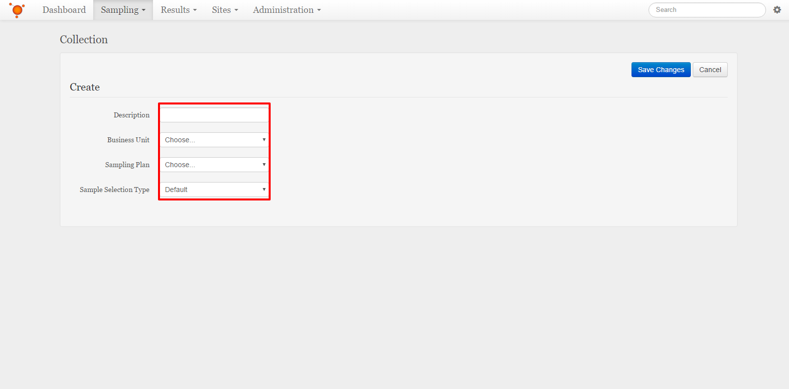
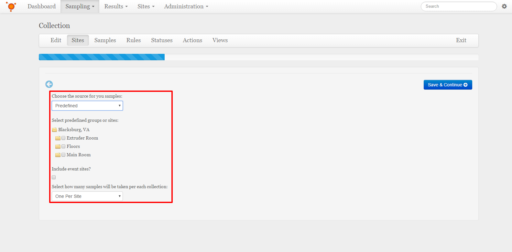
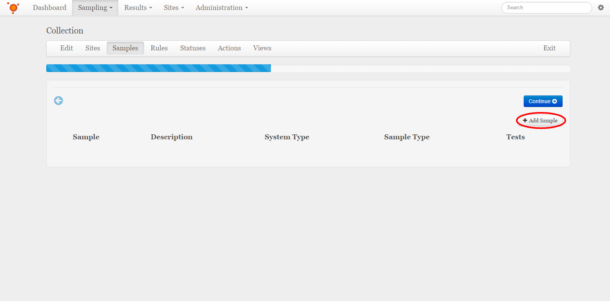
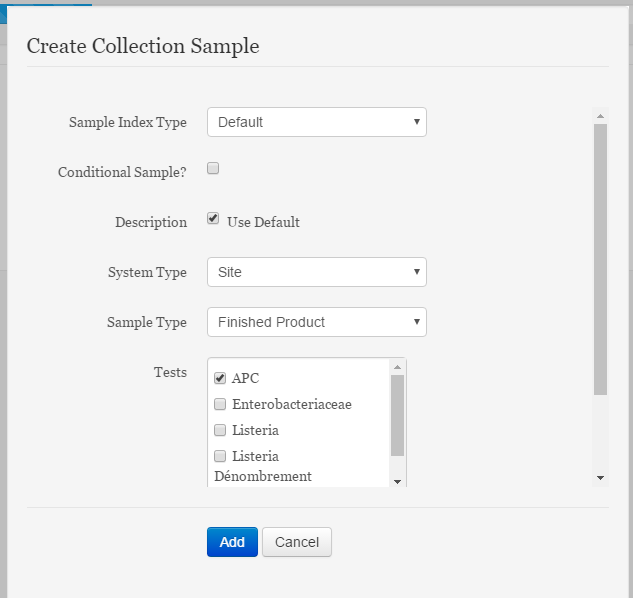
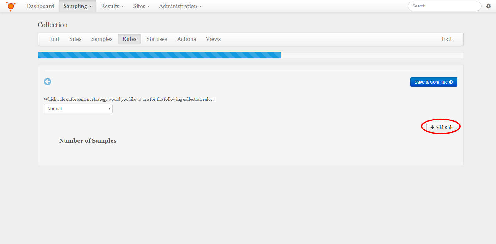
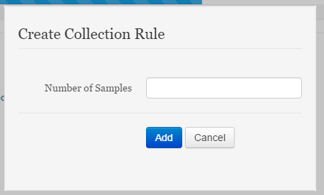
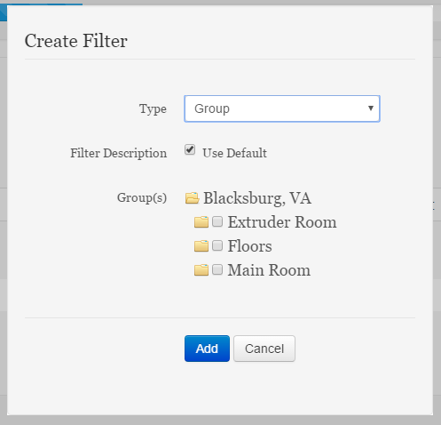

Create a Collection
===============================
Detailing the steps to create a Collection 

**In this Article**
    - `Navigating to the Create new Collection Wizard`_
    - `Filling in basic information and Sample Selection`_
    - `Adding Samples`_
    - `Adding Rules`_
    - `Managing Statuses`_
    - `Managing Actions`_
    - `Managing Views`_
    - `Adding Filters`_
    
Navigating to the Create new Collection Wizard
-----------------------------------------------------
Select the **Samples** dropdown from the Navigation bar at the top of the page, and then the **Collection** item from the dropdown menu that appears.

Select the **+ Create** button at the top right of the *Collections* page to open the *Create new Collection* wizard.

Filling in basic information and Sample Selection
----------------------------------------------------
Fill out all fields for the Collection

Description:
    This is what the Collection will be known by.
Business Unit:
    This is what Business Unit the Collection will operate within.
Sampling Plan:
    This is which sampling plan the Collection is associated with. If there are no Sampling Plans set up, please refer to :doc:`/getting-started-administrator/create-sampling-plan`.
Sample Selection Type:
    This may be Default, which will let the system decide how samples are generated, given parameters in a later step, or Predefined Samples, which allows for a set groupd of samples to be generated each time.
    
When all fields are filled out, select the **Save Changes** button to move on to selecting how samples are chosen for this Collection

.. image:: create-collection/_static/CreateCollection-SaveChanges-EnviroMap.png

Choose how samples will be chosen for this collection, and any necessary fields for that particular choice.

Select the **Save and Continue** button when finished detailing sample sources

Adding Samples 
-----------------
To add a Sample to this Collection, select the **+ Add Sample** button

Fill out the fields required for making a new sample

Sample Index Type:
    This is how the samples will be indexed. Default will allow the system to number and order the samples for you.
Description:
    This is how the Samples will be identified. This can be defaulted to allow the system to build a description from the site description.
System Type:
    This will either set the samples to be individual sites, a composite site, or sampled from unmonitored sites.
Sample Type:
    This is the Sample Type for these samples, if there are no sample types, please refer to :doc:`/getting-started-administrator/create-sample-type`.
Tests:
    These are what tests will be run on these samples
    
Select the **Add** button to close this pop-up and add this rotation to the Collection

To add filters to any sample, please refer to `Adding Filters`_

Select the **Save and Continue** button when finished adding Collection rotations

Adding Rules
--------------------------
To add a Rule to this Collection, select the **+ Add Rule** button, this will bring up the *Add Rule* pop-up

Select a number of samples that must adhere to this rule from the list.

Number of Samples:
    This is the smallest number of samples that must adhere to this rule. 
    
Select the **Add** button to close this pop-up and add this Rule to the Collection

Select what enforcement strategy these rules must follow from the drop down selection box.

To add filters to any rule, please refer to `Adding Filters`_

Select the **Save and Continue** button when finished adding Collection Rules

Managing Statuses
--------------------
All collections are created with the Collection Status Definitions created for that location, as seen in the Administration *Collection Status Definition* page. If more statuses are needed, please create them at that page.

Select the **Continue** button when finished managing Collection Statuses

Managing Actions
------------------
Two collection Actions, Start Sampling and Submit, are already supplied for all Collections, which will move the collection from Scheduled to Sampling and from Sampling to Sampled, respectively.

To manage the Collection Action Fields, which are fields collected when this action is started, please refer to

Select the **Continue** button when finished managing Collection Actions.

Managing Views
------------------
Views allow for alternate displays of data when viewing a collection. To add a view 

To manage the Collection Action Fields, which are fields collected when this action is started, please refer to

Select the **Save and Complete** button when finished managing Collection Views, This will save all work done for the Collection

Adding Filters
--------------------------
To add a Filter to a sample or rule, select the dropdown arrow to the left of the object that needs to have a Filter applied to view the list of Filters for that object

Select the **+ Add Filter** button, which will bring up the *Create Filter* pop-up.

Select the Filter Type, and what qualifiers will be used to help build the sample.

Type:
    This is the field that will be evaluated to check when building a given sample. 
Filter Description:
    This is a way to refer to the specific filter. It can be defaulted to display what the field is being evaluated for.
Operation:
    This is the operation that the value of the field will be checked with. This field will only appear for some selections of Filter Type
Value:
    This is the value that the value of the field will be checked against, in conjunction with the Operation field. This field will only appear for some selections of Filter Type 
Group:
    These are the groups that will be used as a Filter when building a given sample. This field will only appear if the Filter Type is set to Group.
Site(s):
    These are the sites that will be used as a Filter when building a given sample. This field will only appear if the Filter Type is set to Site.
Risk Level:
    These are the Risk Levels that will be used as a Filter when building a given sample. This field will only appear if the Filter Type is set to Risk Level.
Virtual Group:
    This is the Virtual Group that will be used as a Filter when building a given sample. This field will only appear if the Filter Type is set to Virtual Group.
Property:
    This is the Property that will be used as a Filter when building a given sample. This field will only appear if the Filter Type is set to Property.
Property Name:
    This is the name of the property that will be used as a Filter when building a given sample. This field will only appear if the Filter Type is set to Generic.
    
Select the **Add** Button to close this pop-up and add this Filter to the sample or rule.