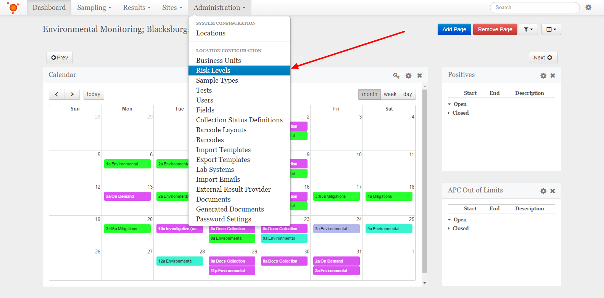
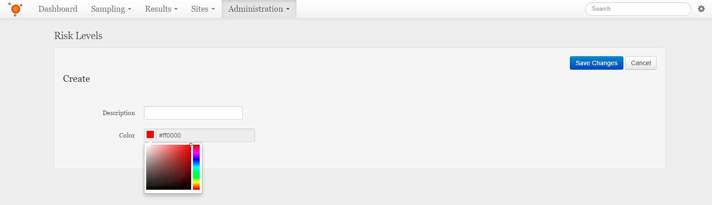

Create a Risk Level
===============================
Select the **Administration** dropdown from the navigation bar at the top, then select the **Risk Levels** item from the list.
Alternatively, if you are already in one of the Administration pages, you can navigate to the Risk Levels from the list on the left.

    
Click or tap the **+ Create** button to the top-right of the Risk Levels list.

Fill in the name of the new Risk Level and select a new color from the color picker

    
When finished, click or tap the **Save Changes** button at the top-right.