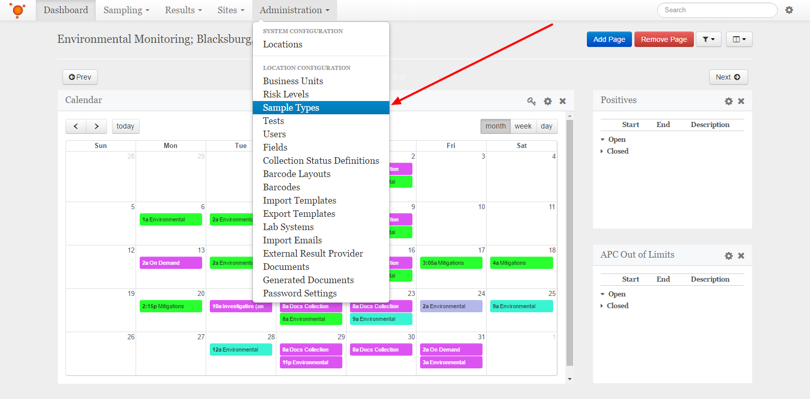
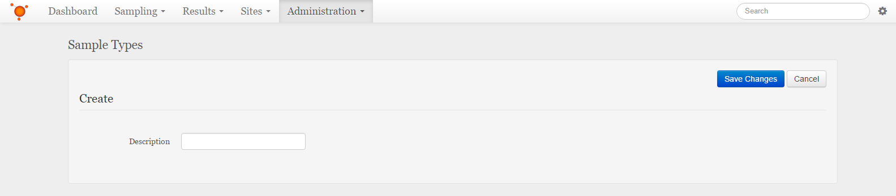

Create a Sample Type
===============================
Select the **Administration** dropdown from the navigation bar at the top, then select the **Sample Types** item from the list.
Alternatively, if you are already in one of the Administration pages, you can navigate to the Sample Types from the list on the left.

    
Click or tap the **+ Create** button to the top-right of the Sample Types list.

Fill in the name of the new Sample Type

    
When finished, click or tap the **Save Changes** button at the top-right.