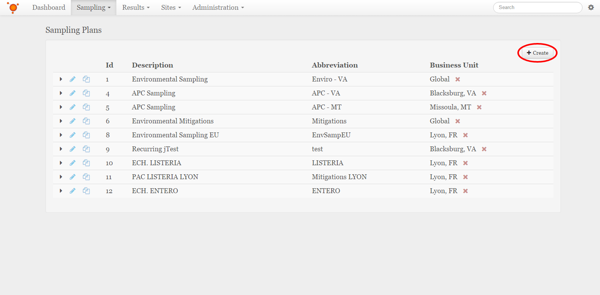
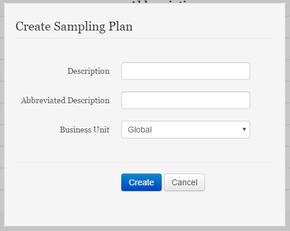

Create a Sampling Plan
===============================
This will detail how to set up a Sampling Plan. Sampling Plans are used to organize and manage the Collections generated by EnviroMap

Click the **Sampling** drop down menu at the top of the screen, and then click on the **Sampling Plans** item from the list.

Once on the *Sampling Plans* page, click the **+ Create** button at the top right of the page, which will bring up the *Create Sampling Plan* pop-up

Fill in the information required for the Sampling Plan, then click the **Save Changes** button

Description:
    This is what the Sampling Plan will be known by. It is best to have this be something that will help to indicate what collections are used in this Sampling Plan.
Abbreviated Description:
    This is what will be used to identify the Sampling Plan when there is not enough space to show the full Description for the Sampling Plan.
Business Unit:
    This is what Business Unit the Sampling Plan will live under. The Sampling Plan may also be a "Global" Sampling Plan, which would mean it is accessible to all business units.