Create a Sampling Program
===============================
Detailing the steps to create a Sampling Program 

**In this Article**
    - `Navigating to the Create new Sampling Program Wizard`_
    - `Filling in basic information and choosing instances`_
    - `Adding Rotations`_
    - `Adding Sampling Plans`_
    - `Adding Test Limits`_
    - `Adding Events`_
    - `Adding Rotation Sources`_
    - `Adding Test Limit Filters`_
    - `Adding Event Jobs`_
    
Navigating to the Create new Sampling Program Wizard
-----------------------------------------------------
Select the **Samples** dropdown from the Navigation bar at the top of the page, and then the **Sampling Program** item from the dropdown menu that appears.

Select the **+ Create** button at the top right of the *Sampling Programs* page to open the *Create new Sampling Program* wizard.

Filling in basic information and choosing instances
----------------------------------------------------
Fill out all fields for the Sampling Program

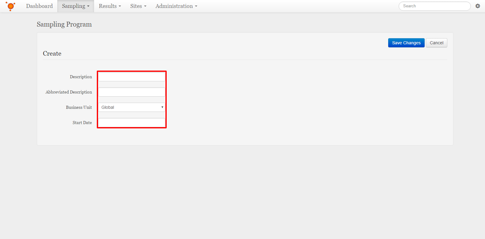

Description:
    This is what the Sampling Program will be known by. It is best to have this be something that will help to indicate what collections are used in this Sampling Program.
Abbreviated Description:
    This is what will be used to identify the Sampling Program when there is not enough space to show the full Description for the Sampling Program.
Business Unit:
    This is what Business Unit the Sampling Program will live under. The Sampling Program may also be a "Global" Sampling Program, which would mean it is accessible to all business units.
Start Date:
    This is what date this Sampling program will go into effect.
    
When all fields are filled out, select the **Save Changes** button to move on to creating instances of this Sampling Program

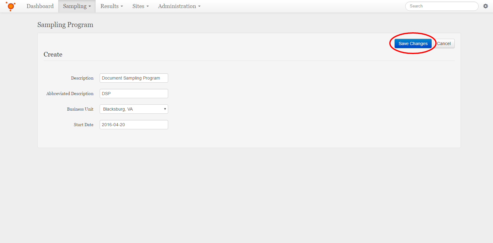

Choose a Business Unit that this Sampling Program should have an instance for, and then select the **+ Add Instance** button to add that instance to the Sampling Program

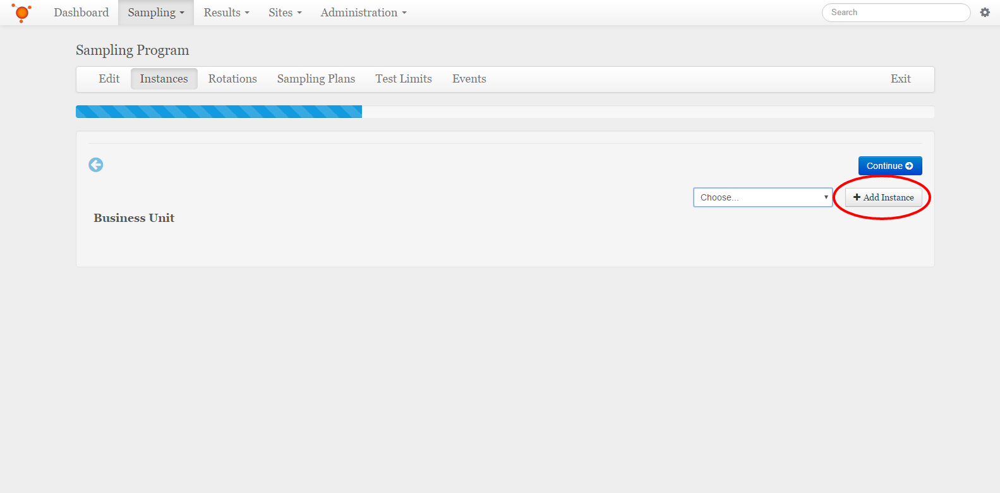

Select the **Continue** button when finished adding Sampling Program instances

Adding Rotations 
-----------------
To add a rotation to this Sampling Program, select the **+ Add Rotation** button

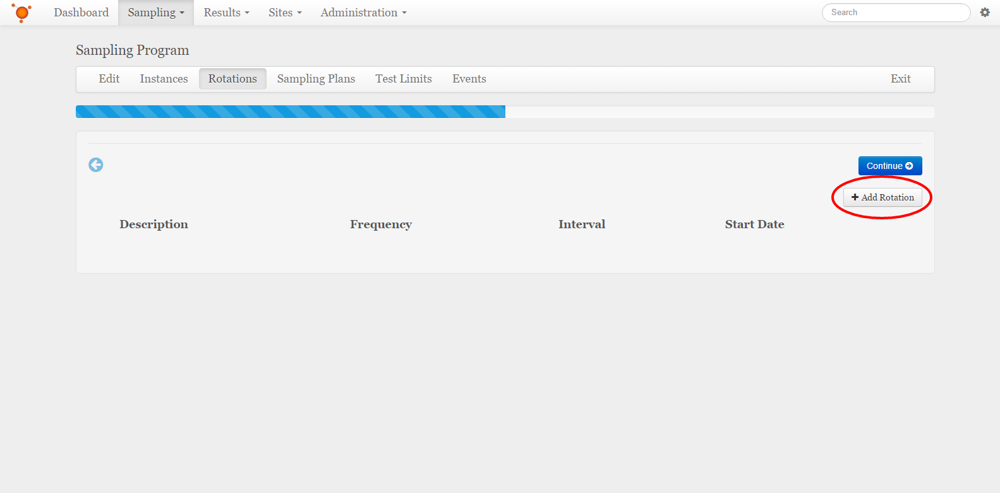

Fill out the fields required for making a new sampling Rotation

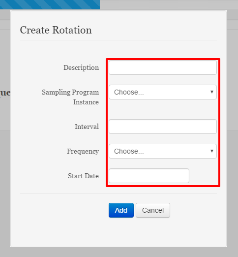

Description:
    This is what the Rotation will be known by.
Sampling Program Instance:
    This is what Sampling Program Instance the Rotation will be associated with.
Interval:
    This is how long this Rotation will last for. This field couples with the *Frequency* field and should be understood together(i.e. 1 week)
Frequency:
    This is the unit of time that the *Interval* field is applied to in order to dictate how long this Rotation will last for. This field couples with the *Interval* field and should be understood together(i.e. 1 week)
Start Date:
    This is what date this Rotation will go into effect.
    
Select the **Add** button to close this pop-up and add this rotation to the Sampling Program

To add rotation sources to any rotation, please refer to `Adding Rotation Sources`_

Select the **Continue** button when finished adding Sampling Program rotations

Adding Sampling Plans
--------------------------
To add a Sampling Plan to this Sampling Program, select the **+ Add Sampling Plan** button, this will bring up the *Add Sampling Plan* pop-up

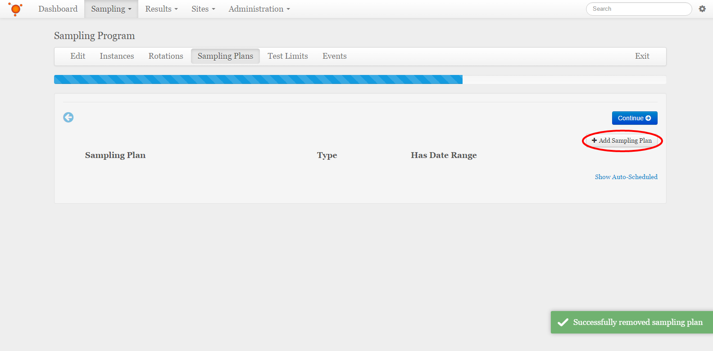

Select a Sampling Plan from the list, and what type of collection schedule should be used with this Sampling Plan within this Sampling Program. If you have not already made a Sampling Plan, please refer to :doc:`/getting-started-administrator/create-sampling-plan`.

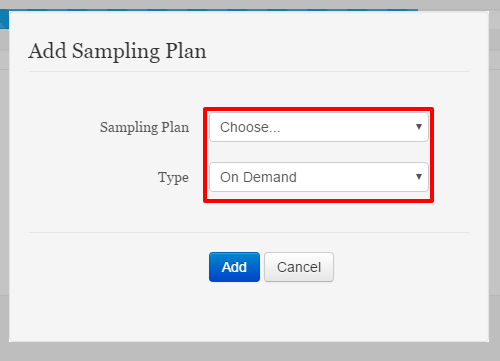

Sampling Plan:
    This is a Sampling Plan that this Sampling Program will utilize. 
Type:
    This is the scheduling type of the Sampling Plan. Values include On Demand; which will only happen when specially ordered, Once; which will only occur the once on the chosen date and time, Recurring; which will require a recurrence pattern to be set up that will dictate how often this sampling plan is implemented, and Mitigation; which will only occur on set triggers such as out of limit test results.
    
Select the **Add** button to close this pop-up and add this Sampling Plan to the Sampling Program

Select the **Continue** button when finished adding Sampling Program Sampling Plans

Adding Test Limits
--------------------
To add a Test Limit to this Sampling Program, select the **+ Add Test Limit** button, this will bring up the *Add Test Limit* pop-up

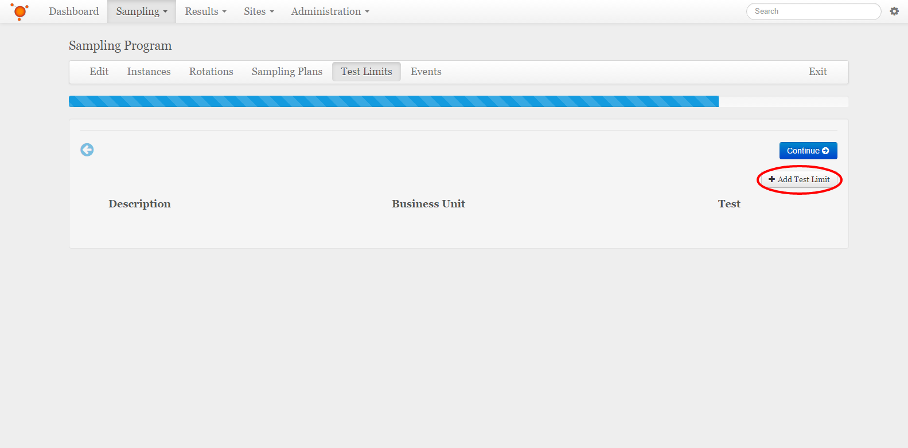

Select a Business Unit, and a Test from the list, and what color any results that violate this limit will be shaded. If you have not already made a Test, please refer to :doc:`/getting-started-administrator/create-test`.

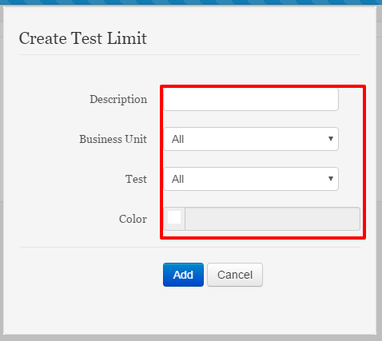

Description:
    This is what the Test Limit will be known by.
Business Unit:
    This is what Business Unit the Test Limit will apply to. *All* is an option that would apply this test limit to all Business Units that this Sampling Plan has instances for.
Test:
    This is the Test that this Limit wil check for the filters that are applied to it. 
Color:
    This is the color that any out-of-limit results will be shaded when viewed on the results map or any charts.
    
Select the **Add** button to close this pop-up and add this Test Limit to the Sampling Program

To add any filters for a test limit, please refer to `Adding Test Limit Filters`_

Select the **Continue** button when finished adding Sampling Program Test Limits

Adding Events
---------------
To add an Event to this Sampling Program, select the **+ Add Event** button, this will bring up the *Create Event* pop-up

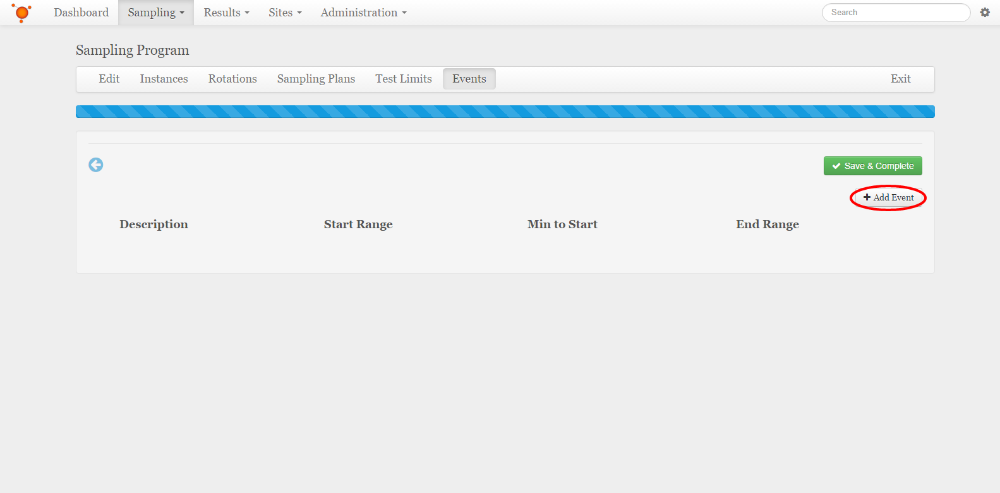

Select which Test Limits this Event will trigger on, which Business Unit this event will occur within, as well as the stipulations for starting and ending this event. 

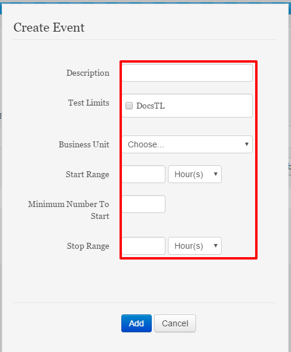

Description:
    This is what the Event will be known by.
Test Limit:
    These are the Test Limits that this Event wil trigger from.
Business Unit:
    This is what Business Unit the Event will apply to.
Start Range:
    This is the window of time that will start the Event if the *Minimum Number to Start* number of out-of-limit results are hit within the window.
Minimum Number To Start:
    This is the amount of out-of-limit results that must be reported in order to start this event.
Stop Range:
    This is the amount of time that the Event will stop after.

Select the **Add** button to close this pop-up and add this Event to the Sampling Program

To add specific jobs to be executed with an event, please refer to `Adding Event Jobs`_

Select the **Save and Complete** button when finished adding Sampling Program Events, This will save all work done for the Sampling Program

Adding Rotation Sources
------------------------
To add a source to a rotation, select the dropdown arrow to the left of the Rotation that needs to have a source applied to view the list of sources for that rotation

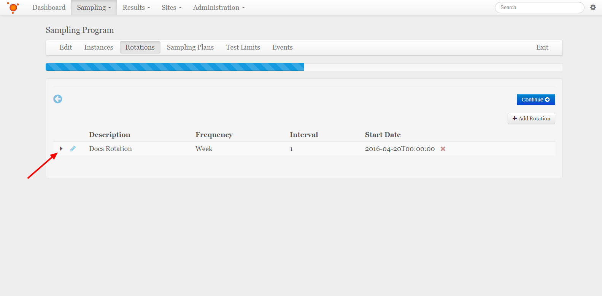

Select the **+ Add Source** button, which will bring up the *Create Rotation Source* pop-up.

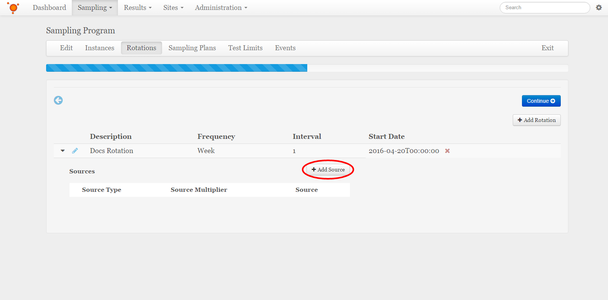

Select the Source Type, which source of that type, and what percentage or multiplier of that source will be used for this rotation.

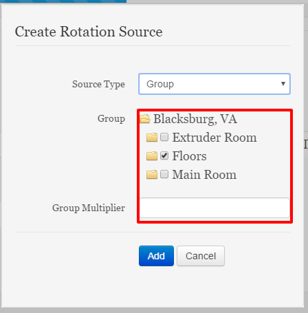

Source Type:
    This can be another Rotation, a Group, or a Virtual Group. If there have not been any groups set up, please refer to :doc:`/getting-started-administrator/add-groups`.
Rotation:
    This is a separate Rotation that will be used as a source for this current Rotation. This field will only appear if the Source Type is set to Rotation.
Rotation Percentage:
    This is the percentage of the source Rotation that will be used to supply the current rotation. This field will only appear if the Source Type is set to Rotation. 
Group:
    This is the group that will be used as a source for this current Rotation. This field will only appear if the Source Type is set to Group.
Group Multiplier:
    This is the amount that the sites in this group will be multiplied by when populating the rotation. This field will only appear if the Source Type is set to Group.
Virtual Group:
    This is the virtual group that will be used as a source for this current Rotation. This field will only appear if the Source Type is set to Virtual Group.
Virtual Group Multiplier:
    This is the amount that the sites in this virtual group will be multiplied by when populating the rotation. This field will only appear if the Source Type is set to Virtual Group.
    
Select the **Add** Button to close this pop-up and add this source to the rotation.

Adding Test Limit Filters
--------------------------
To add a Filter to a Test Limit, select the dropdown arrow to the left of the Test Limit that needs to have a Filter applied to view the list of Filters for that Test Limit

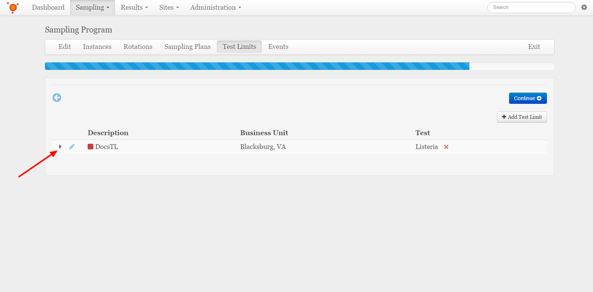

Select the **+ Add Filter** button, which will bring up the *Create Filter* pop-up.

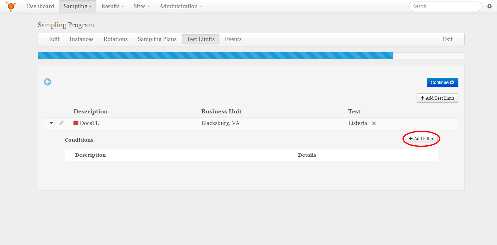

Select the Filter Type, and what qualifiers will be checked on that type for this Test Limit.

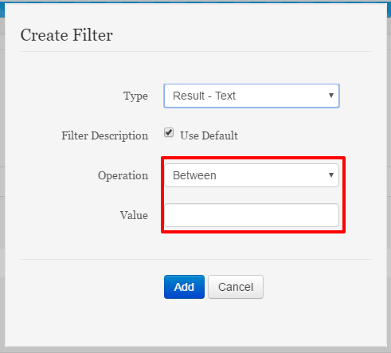

Type:
    This is the field that will be evaluated to check for a given sample to determine if it is violating the Test Limit. 
Filter Description:
    This is a way to refer to the specific filter. It can be defaulted to display what the field is being evaluated for.
Operation:
    This is the operation that the value of the field will be checked with. This field will only appear for some selections of Filter Type
Value:
    This is the value that the value of the field will be checked against, in conjunction with the Operation field. This field will only appear for some selections of Filter Type 
Group:
    These are the groups that will be used as a Filter for this current Test Limit. This field will only appear if the Filter Type is set to Group.
Site(s):
    These are the sites that will be used as a Filter for this current Test Limit. This field will only appear if the Filter Type is set to Site.
Risk Level:
    These are the Risk Levels that will be used as a Filter for this current Test Limit. This field will only appear if the Filter Type is set to Risk Level.
Sample Types:
    These are the Sample Types that will be used as a Filter for this current Test Limit. This field will only appear if the Filter Type is set to Sample Type.
Property:
    This is the Property that will be used as a Filter for this current Test Limit. This field will only appear if the Filter Type is set to Property.
Property Name:
    This is the name of the property that will be used as a Filter for this current Test Limit. This field will only appear if the Filter Type is set to Generic.
    
Select the **Add** Button to close this pop-up and add this Filter to the Test Limit.

Adding Event Jobs
-------------------
To add a Job to a Event, select the dropdown arrow to the left of the Event that needs to have a Job applied to view the list of Jobs for that Event

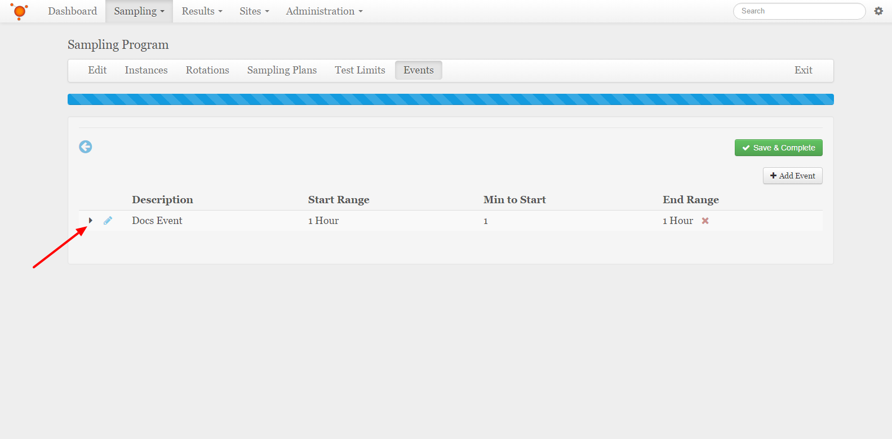

Select the **+ Add Event Job** button, which will bring up the *Create Event Job* pop-up.

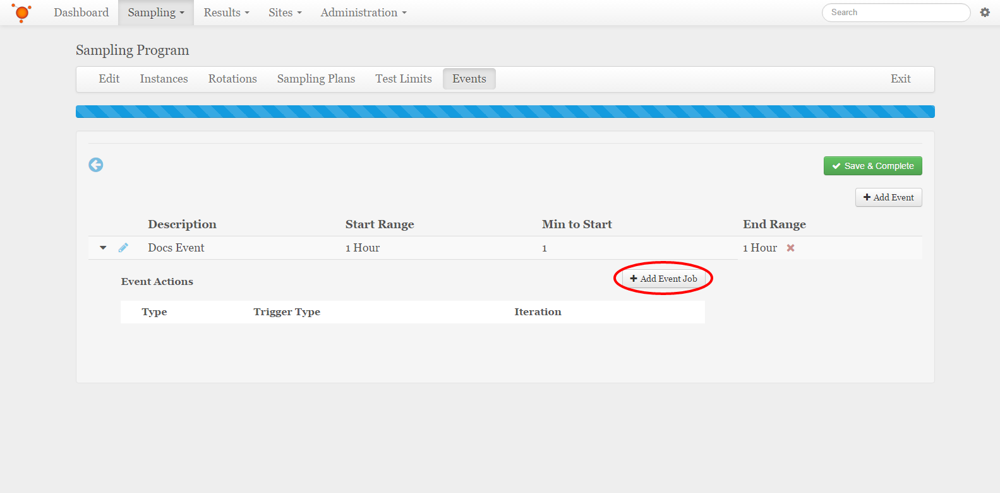

Select the Job Type, and what additional information is needed for that particular event job type.

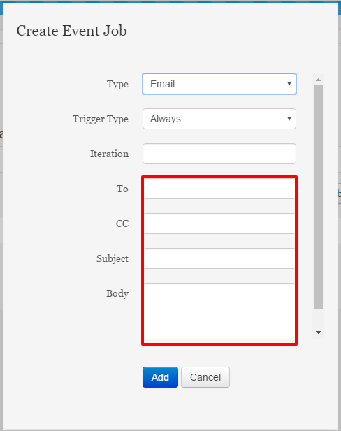

Type:
    This is the Type of Event Job that wil be executed when the event occurs.
Trigger Type:
    This will trigger the job either every time the event is triggered, once per sample, or once per number of set iterations.
Iterations:
    This is the number of iterations that the job will be triggered.
    
Select the **Add** Button to close this pop-up and add this Job to the Event.