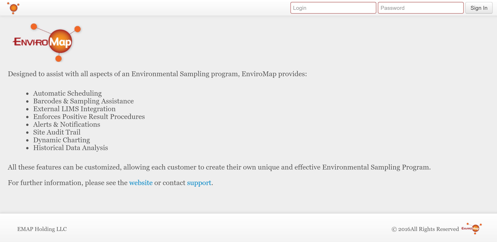
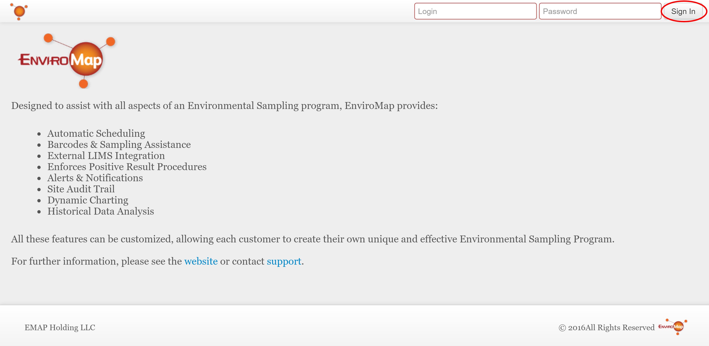
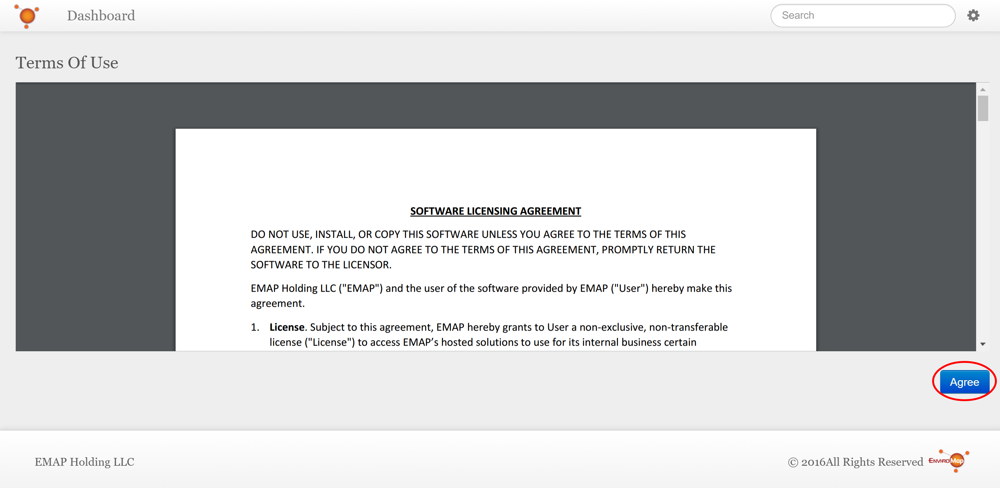
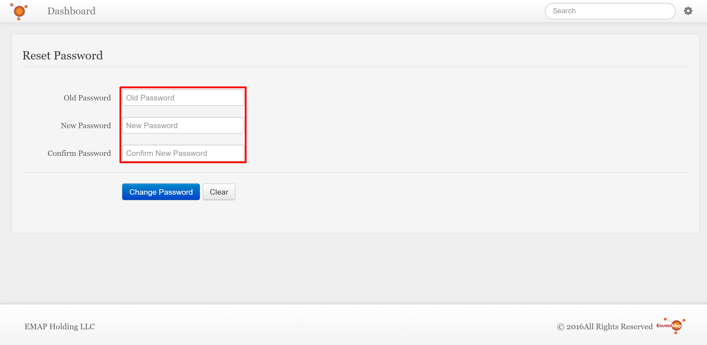
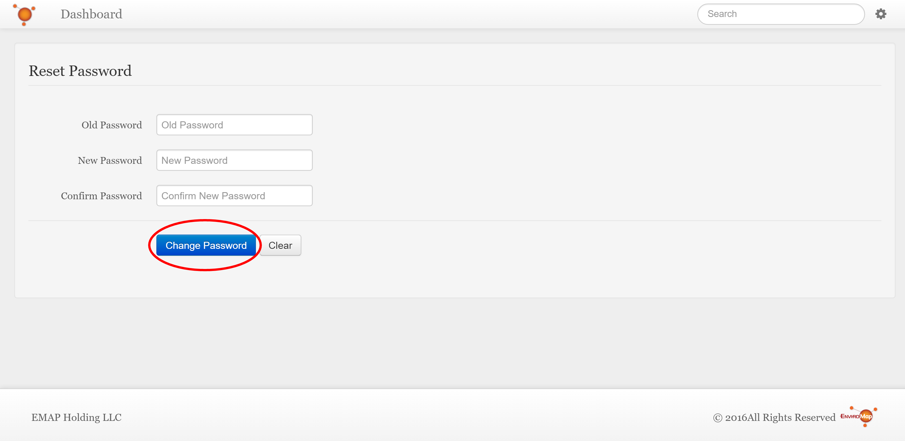

Log In
===============================

Logging in is required to access any of EnviroMap's features. The first time you log in you will be required to agree to the *Terms of Use* and reset your password. Every subsequent login will simply direct you to your personal *Dashboard* page. Please see :doc:`/getting-started-analyst/setup-dashboard` for more information on how to configure your dashboard.  

**In this article:**
	- `Logging In`_
	- `Agreeing to the Terms of Use`_
	- `Resetting your Password`_
	
Logging In
---------------

Open your browser and navigate to your company's EnviroMap website.

Enter your **Login** and **Password**.

.. note::
	
	Your user name and password will be provided to you by your company.

.. tip::
	
	If you forget your password, any user with an *Administrator* account should be able to reset it for you. Alternatively, you can contact support@enviromap.com to assist you.

.. image:: log-in/_static/username-password-focus.png
	

Click the **Sign In** button.

Agreeing to the Terms of Use
-----------------------------

Read the *Terms of Use*, then click the **Accept** button to continue.

Resetting your Password
---------------------------

Enter the following fields:

Old Password:
	Enter the password you just logged in with.
	
New Password:
	Enter what you want your new password to be.

Confirm Password:
	Re-enter what you want your new password to be (this must be the same as what you entered for *New Password* above).

.. note::
	
	Depending on your company's policies, there may be password requirements that you must meet. If your new password does not meet these policies you will see an error message that will provide you with the miniumum requirements for your new password.

 
Click the **Change Password** button.

