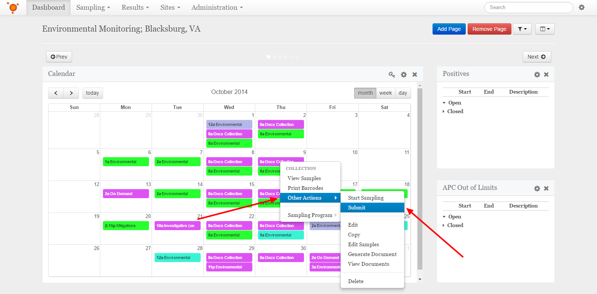
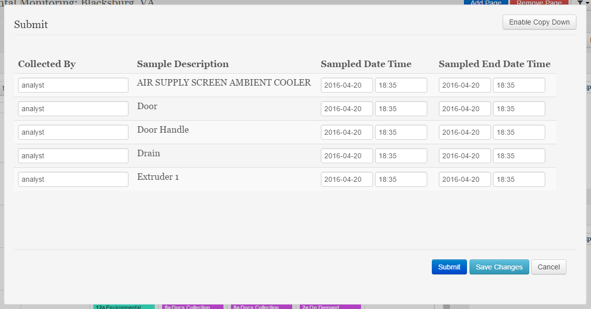

Submit Collection
===============================

Submitting samples for a Collection is performed within the *Calendar* widget from your dashboard. If you haven't already setup your dashboard please see :doc:`/getting-started-analyst/setup-dashboard`.

Submitting Samples for a Collection
--------------------------------------

Right click on the collection that you would like to submit. From the context menu, select **Other Actions**, and then select **Submit**.

.. note::

	If this is the first time this collection has been opened, you will first need to confirm the samples. Click the **Save Changes** button on the *Select Samples* popup to continue. See :doc:`/getting-started-analyst/view-and-print-samples` for more information.

In the popup window, fill in the data for the samples in the collection. The copy down features is enabled by default, it will copy any data entered down to all the fields below it.

	
Once all data has been entered, click the **Submit** button. If you will need to return and enter some data later, select the **Save Changes** button.

.. note::

	If your samples are being electronically submitted to a LIMS system, this process may take some time. Please wait until the the popup window closes to confirm that your samples were successfully submitted.
