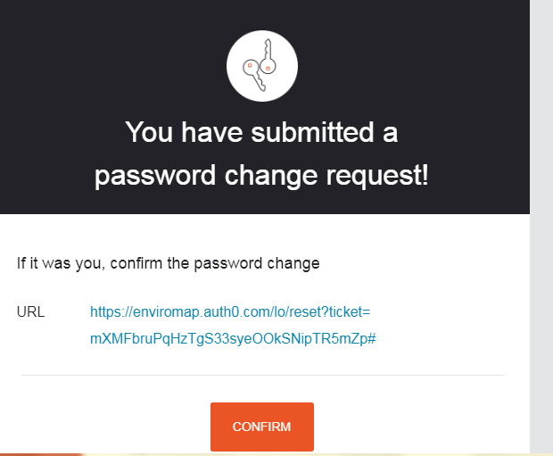
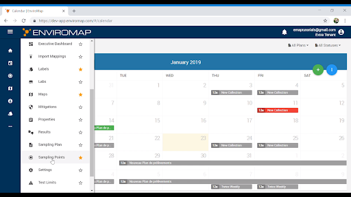

Getting Started
===============

Login and Updating Password
---------------------------

EnviroMap v6 can be accessed at the following link - https://app.enviromap.com

This will open a login window: 

.. image:: 1.png

Your username will be your email address. If you did not receive an email or cannot locate your password, select the “Don’t remember your password” for a password reset. 

EnviroMap will open to your dashboard. 

To update your password, click on the person icon in the upper-right corner and select Change Password. 

.. image:: 2.png

This will send a change password email to your email account.  Open the email and click Confirm. 

Enter a new password to change your login credentials. 

Dashboard Overview
------------------

Side Menu Overview (brief description of function) 
--------------------------------------------------
The site is navigated through the side menu located on the left side of the screen.

The menu can be expanded by clicking menu icon on the top. 
It can be collapsed by clicking on arrow.  

Additionally, the ellipses icon at the bottom of the menu allows User to open an expanded view and select the specific menu item that will allow User to do a variety of functions in the applications.

These functions range from creating Sampling Points to Printing labels.

User can click on the  icon to save the particular menu item, which will then appear in the side menu bar as favorite.

Calculations
------------
Calculations is an advanced user function to create scripts for different data population functions.

Calendar
--------
Calendar provides users to add test, add Collections according to the users requirement of date and time
Users can schedule test date and time using the Calendar.

Collections
-----------
Using this feature users can have a look at the Collections that are available to be submitted. User can search Collections for a particular time duration from this section.

Command Requests
----------------
User can view all the Command that have taken place. User can view whether those particular requests have been completed successfully or not by looking at 
the presence of green color mark

Documents
---------
This section shows all the documents that have been submitted by User that are now available in the system, including export file template, SARFs, and other generated documents.. User can search using the search box given at the top

Email Notifications
-------------------
User can set new email notifications according to any criteria available in the system.User can search using the search box given at the top

Executive Dashboard
-------------------
User can navigate to the executive dashboard for an multi-facility overview of how each business unit is performing.

Import Mappings
---------------
This section shows all the templates for any imported data into the system.

Labels
------
The section allows users to create, modify and delete the formatting templates for EnviroMap generated sample labels. 

Labs
----
Labs can  be used to define the interface information for FTP and related data-exchange with any external labs

Maps
----
All the maps that are currently used in the system are visible from here. User can use this menu item to check on the map details, add a new map or delete an existing map.

Mitigations
-----------
User can set Trigger on sample, based on certain criteria. Tests, Trigger category, Samples OOS, Risk Levels and Conditions. When all the conditions and criteria are met, User shall receive a trigger notification.

Properties
----------
This section will allow the user to define the types of attributes to assign to the sampling points.

Results
-------
The Result menu item shows the system wide results for all the sample in the given time frame. User can select/deselect choice of columns to be viewed on the grid view. Users can also download the result view in excel format.

Sampling Plan
-------------
Sampling allows user to set mitigation plans, schedule, Test limits and choose which all samples this applies to all Sample that arrive in the system. 

Sampling Points
---------------
Users can add, update, remove sampling points in the system using this menu items. User can view in the column view or in the tree view. In this section user will be able to create & edit Sampling Points and import new Sampling Points from Excel files.

Settings
--------
Users can set basic setting from this options eg Language.

Test Limits
-----------
Test Limits give details about each test that are saved in the system. Users can set new test along with new limits ie acceptable/non acceptable values for that test.

Tests
-----
This section provides details for all the tests that currently exist in the system along with their specifications. User can add, edit and delete any test form here.

Users
-----
User can see all other users of the system in the section. User can create new users with required user permission like Read Documents, Change Calculations etc from here.
