Managing Sampling Points
========================
In this section, users will be able to create & edit Sampling Points, change between the Column & Tree Views on the Sampling Point blade and import new Sampling Points from Excel files.

Sampling Points can be accessed through the menu option as shown in the image.
Sampling Points can be viewed in two ways:

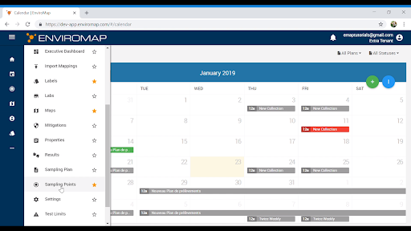
 
- Column view
- Tree view
    
In the Tree view, Sampling Points will be displayed in the folder structure which can be drilled down to the lowest level.

In the Column view, Sampling Points information will be displayed in row and columns under appropriate headers.

User can change the view from the more option on the Sampling Points page

   
Column View:
----
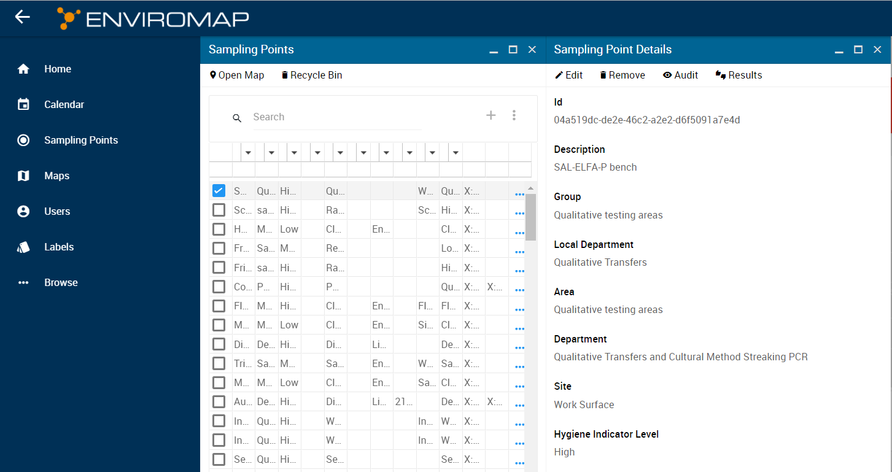

Tree View:
----
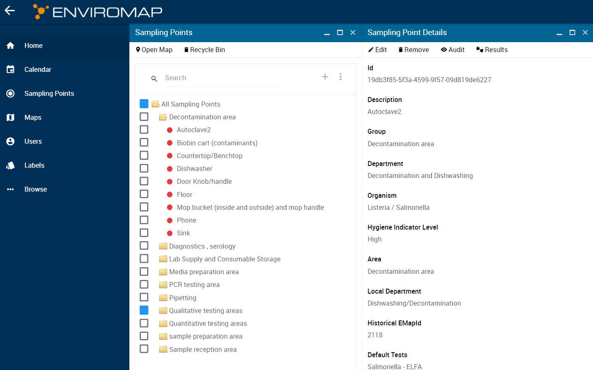

Adding/Removing Sites
-------------------------
Users can also Add/Remove/Update sites based on requirements.
To Add a site click on the + sign on the Sampling Points page.

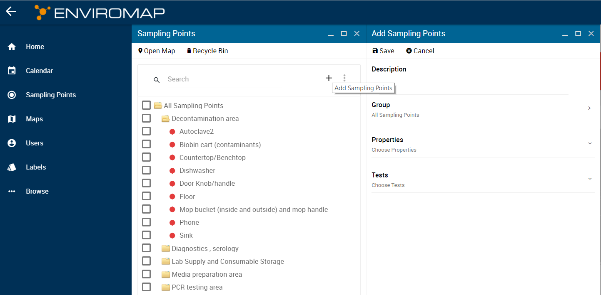

Add Sampling Points by providing details in the Description, Group, Properties and Test section. User can however add each of these new Sampling Points when required.
Once that is done, Click on Save and the Sampling Point is created.

To Remove a Site, right click on the Site from the required folder and click on the Remove option or go to the more option after selecting the Sampling Points and Click on Remove

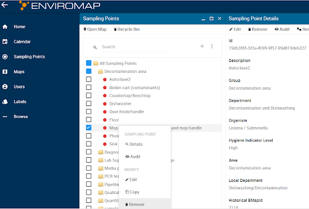

Please be aware that deleting sites will remove historical data (sampling and results) from EnviroMap. 

Archiving/Moving Sites
----------------------
User is able to assign and move sites between groups (represented by the folders). 

To create a new folder: 
Right click on the All Sampling Points and select Add Groups

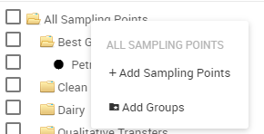

Enter the new of the new group and select the parent group. Click save. 

Open the Sampling Points and select the Tree view by clicking the ellipse: 

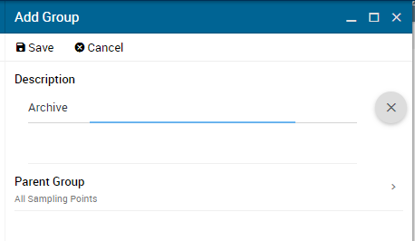

To move sites to a different group, User selects the sites they wish to move and can drag and drop the sites it the desired folder, or

Click on the ellipses and select Edit. The Edit blade will open. Click on the Group and the Select Group blade will open. User can then select the Group where they want to move the sites (in this case Archive). Click on Confirm and Save.

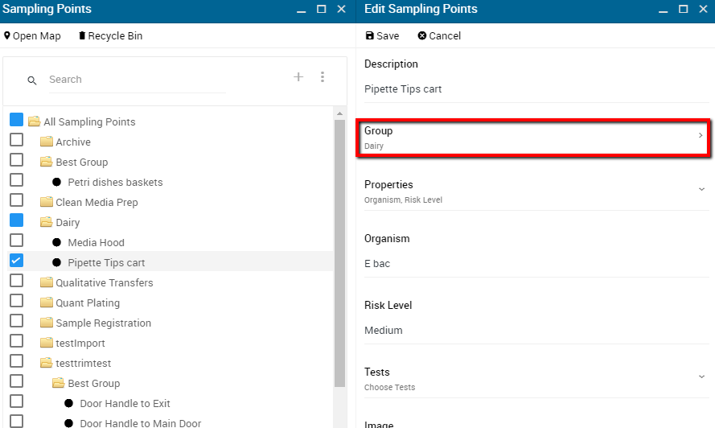

The sites will have moved to the chosen folder. Sites can be moved to an Archive folder  in the same process.

Updating Sites
--------------
To Update a Site select the required Site from the Sampling Points section, details will emerge on the right hand side.Click on the Edit option.
This will open details where user can assign Group, Properties, Tests to users’ new preferences.
User can also edit the image.

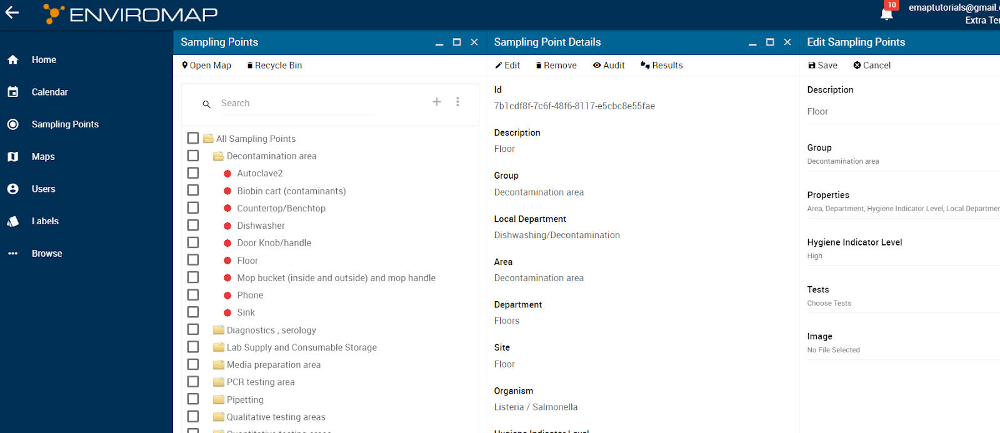

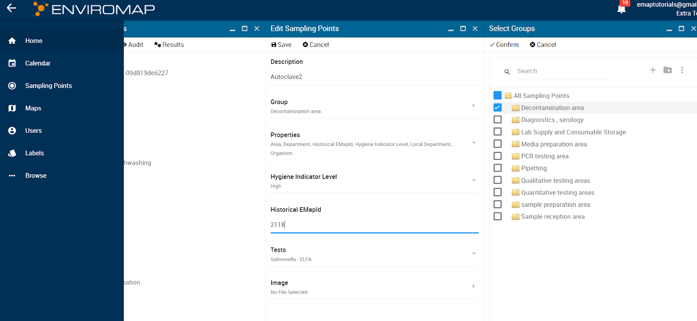

Click on the confirm option.
Once confirmed the Sampling Points will now show details with updated information.

User can also Import to file to the Sampling Points:
Click on the more option on the Sampling Points window and then the Import option.
User can choose the file according to their preferences to upload.

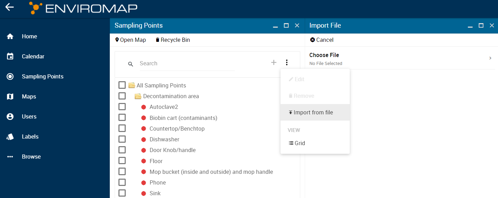

Preview of the uploaded file will also be displayed once file is uploaded.From then on  User can Click on Import.

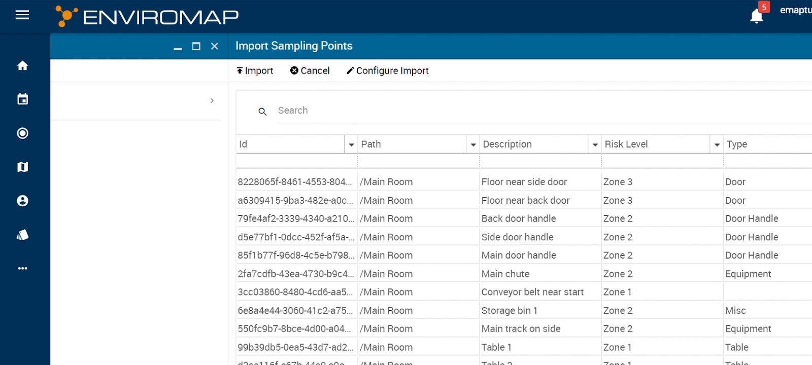

Import from file will help to import a list of site to the system. 

Plotting Sites on the Map
-------------------------
To plot Sites on the map, go to the Sampling Point menu in the application. By clicking on the Open Map in the upper left section, map in the application will open, if they are uploaded
User can have multiple maps uploaded. By clicking on the left and right arrow icons, user can toggle between maps.

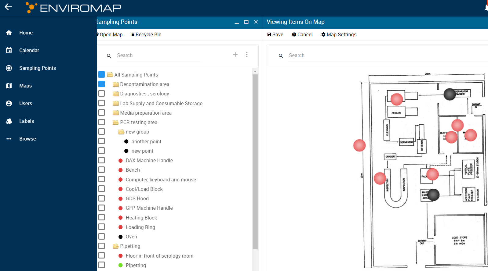

User can click on the Sampling Points list and select the site and then Drag and Drop the site to a point in the map where user desires it to be.
User can view the details of the Plotted points by clicking on the dot thats is plotted on the map..
User can go to the map setting by clicking on the icon “⛭ Map Settings”. 
User can change the Sampling Point color, by selecting the preferred property. The size of the dot can also be changed.
To save the points that are plotted on the maps, click on the save option given on the maps sections. The plotting of point will appear in the order of the Sampling Points hierarchy in the folder structure.

Importing Sites from File
-------------------------
The User can add multiple sites at a time using a file import. 

The User would create and configure an Excel file with the samples with the appropriate column headings: 

Group (indicates the folder name for the sampling points) 
Description 
Risk Level (indicates Zone) 
Tests (indicates default test name) 
User can add other sample properties like Region, Room, Line, etc. 

Example of a Sample Import File: 

Next Navigate to the Sampling Points blade

Once the blade is open, click on the third ellipses to open the menu and select Import from file: 
Click on the arrow to Choose a File
Select the file from the file selection window and hit Open.
This will open a preview of the samples:
If they look right, click the import at the top.
The samples should be imported into the folder with all the relevant parameters:
You can then add the sample points to the map. 
