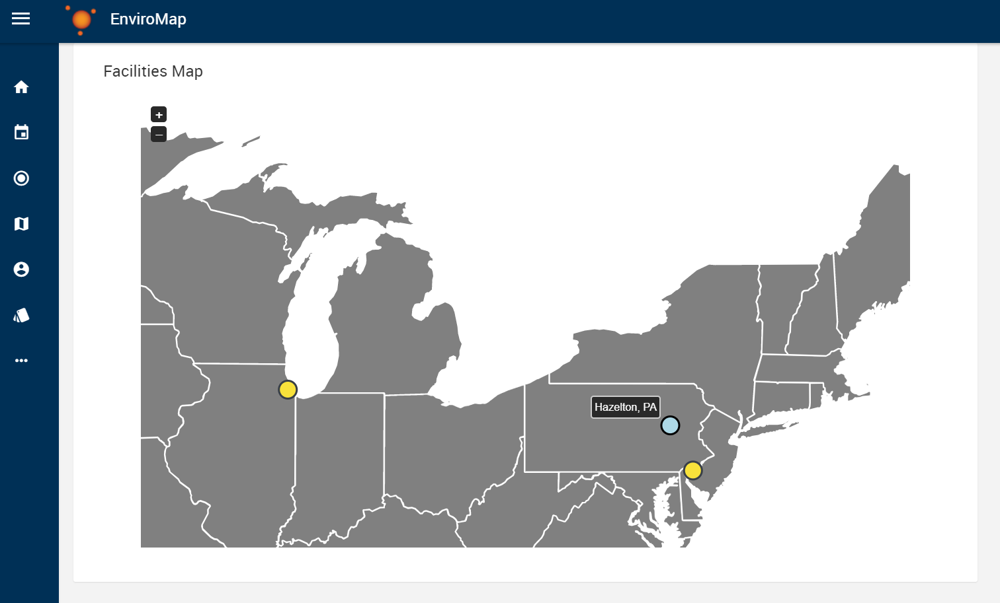

Title of the Page
=================

When writing the title, you'll need to change the number of "=" underneath to match the length of the name. It's goofy, but that's just how the docs manager works.

Sub-heading
-----------

- Use
- Dashes
- Like
- This
- As
- Bullet Points

When inputting a screenshot, you'll need to make a folder named after your current file, then one named "_static" which holds the picture you want to use. For example:

.. note::

	Here's the formatting to put an important note. Use to identify common problems or make the user aware that something is significant.

To use raw HTML, simply use the raw tag below. In this example it's used to post an embedded video from youtube:

.. raw:: html

    

        <iframe src="https://www.youtube.com/embed/hrl2oB5jm6M" frameborder="0" allowfullscreen style="position: absolute; top: 0; left: 0; width: 100%; height: 100%;"></iframe>
    

Finally, when your new page is done, make sure to add it to the appropriate "index" so it can be found by users. Think of the index files as the "Table of Contents" for each section.
For example, like in "tutorial-videos/index.rst", as long as the file name is listed under the "toctree" heading in the same manner, users will be able to click on it to visit the page.

To navigate to this template to see what all these things look like in practice, 
visit "https://enviromap.readthedocs.io/en/latest/overview/template.html"