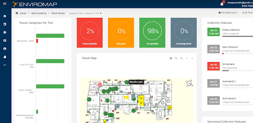
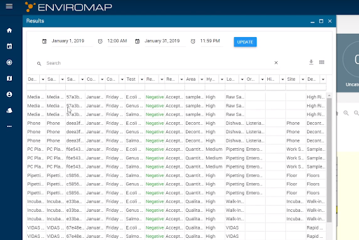
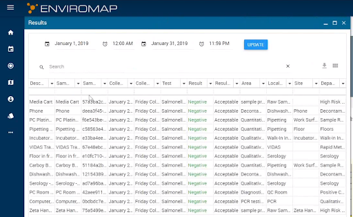
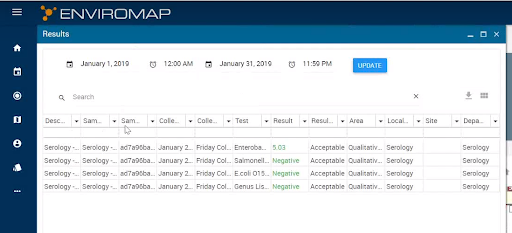

Viewing Results
===============
Results can be viewed in a number of ways.

 

Acceptance Percentage Boxes
---------------------------
When users click on any of the boxes, a grid view will open corresponding to the results for that box

	
Result Categories per Test
--------------------------
Users can also view results in the gridview based on the classification of the test that are in the system.

Result Map
----------
User can click on the plotted point that are on the maps.This will open a grid view of results corresponding to the sample information for that location in the facility.

Collection Statuses
-------------------
Users can also check the Collection Statuses for Sampling information, by clicking on the Collection on the right hand side.

.. image:: 5.png

Users can view the results by simply going to the Result blade from the main menu.
This is will open results for all the samples in the system for the given date range
